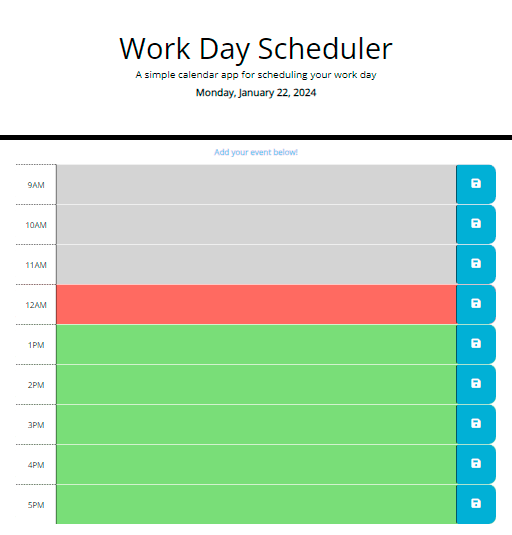
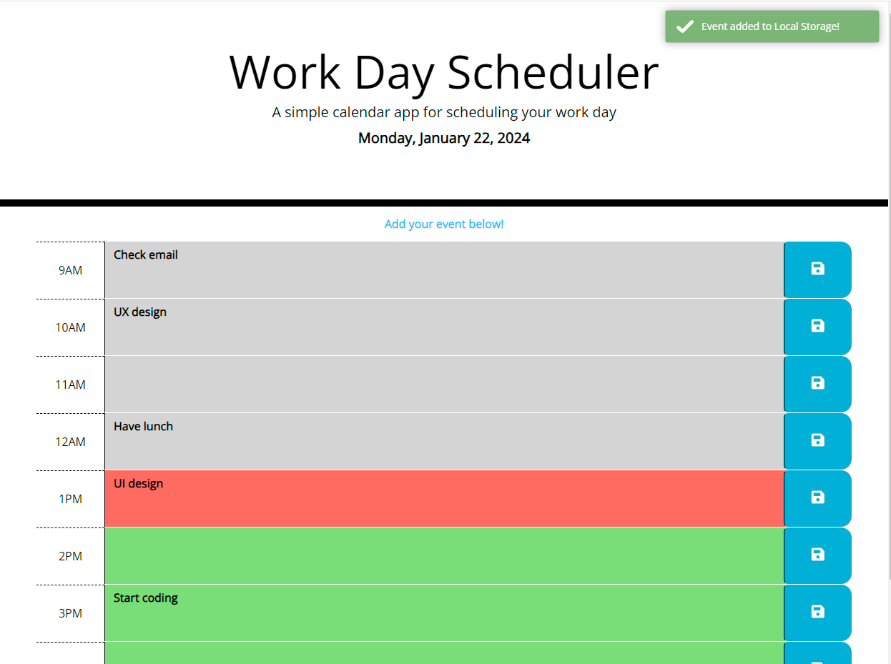
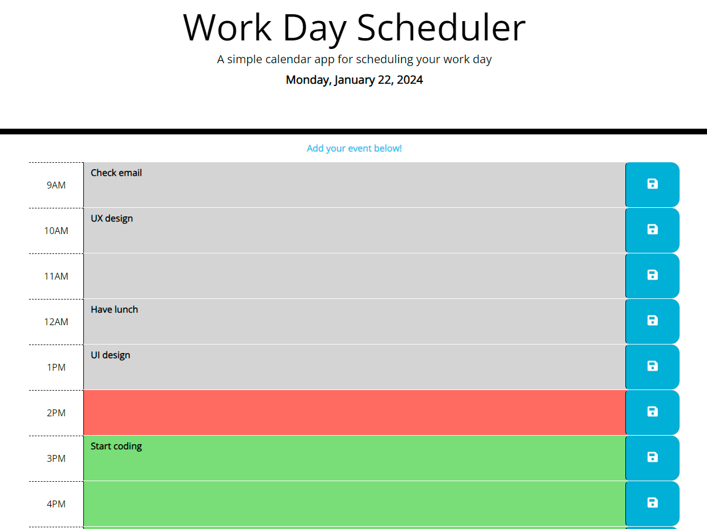
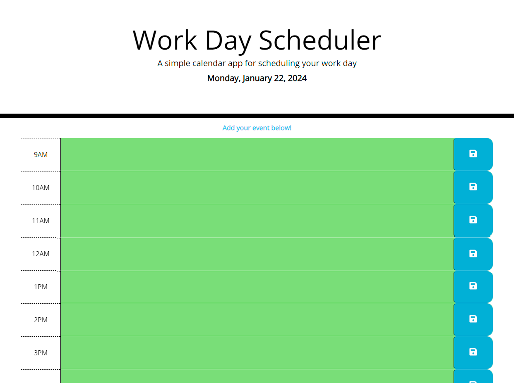
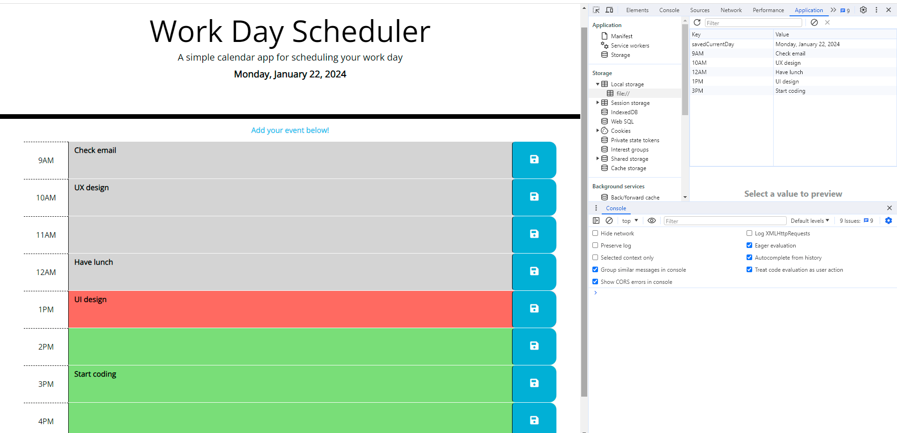

# Work-Day-Scheduler-JS
Module 7 Challenge Third-Party APIs: Work Day Scheduler

## Description 

This Work-Day-Scheduler-JS was created for bootcamp students who were taking the seventh week's challenge. In this challenge, my task was to create a simple calendar application that allows a user to save events for each hour of the day.

The calendar application must meet the following critical requirements:

* Display the current day at the top of the calender when a user opens the planner.
* Present timeblocks for standard business hours when the user scrolls down.
* Color-code each timeblock based on past, present, and future when the timeblock is viewed.
* Allow a user to enter an event when they click a timeblock
* Save the event in local storage when the save button is clicked in that timeblock.
* Persist events between refreshes of a page

## Installation

N/A

## Usage 

To use Work-Day-Scheduler-JS,  you can review each file. 
To check whether the application meets critical requirements, open the webpage [Work Day Scheduler](https://qingh2o.github.io/Work-Day-Scheduler-JS/). 

Once the Work-Day-Scheduler-JS web page loads, the color code is grey for the past, red for the present, and green for the future. Page display depends on when you load the page.

The application should look similar to the screenshot below. 

### Display key feature

* Display notification after the user clicks the save button.

* Display events on the page when the user loads the page at different times of the day.

* Display empty time blocks when a new day starts

### Inspect page using Chrome DevTools
Open Chrome DevTools by right-clicking the page and selecting "Inspect". An Elements panel should open either below or to the side of the webpage in the browser. Click the Applications tab and expand Local Storage in the Storage section to see saved events displayed on the right.

The "Inspect" page should look similar to the screenshot below.

## Credits

N/A

## License

Please refer to the LICENSE in the repo.

